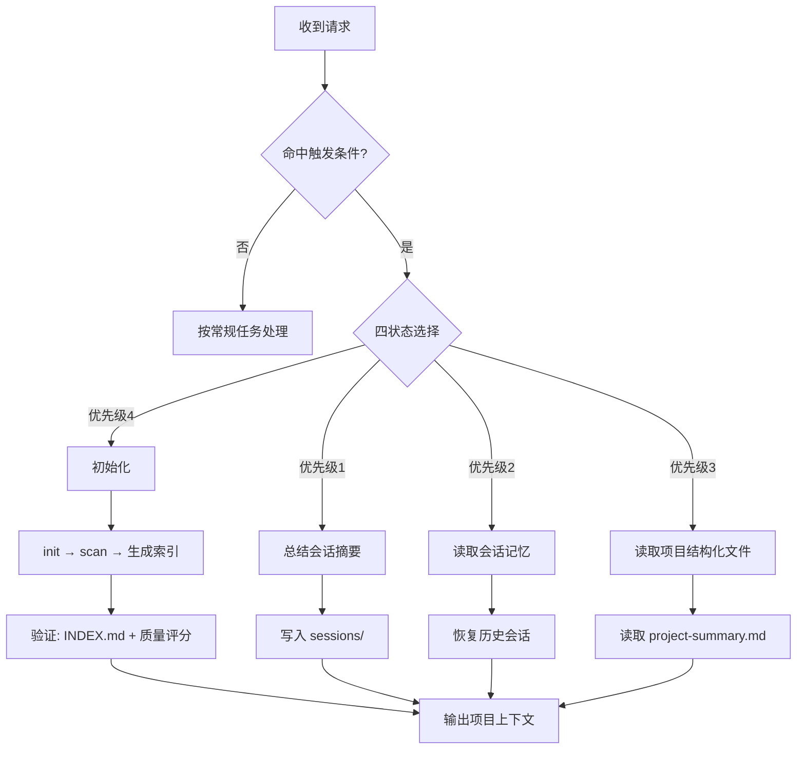

# Forge Memory

## 目标

在用户显式触发，或用户明确要求全面了解/全面扫描项目时，使用本 skill 在项目根目录创建或读取 `.project-context/`，作为项目本地记忆层。
它让 Claude Code 面对大型项目时先读取结构化摘要和知识图谱，再按需定向读取源码。

这个 skill 负责项目认知，不负责源码备份。摘要和图谱应描述结构、决策、关系、风险和会话状态，不应大段复制源码。

## 读取参考

执行前按需读取：

- `references/workflow.md`：首次使用、恢复记忆、会话摘要、结构化扫描流程。
- `references/schema.md`：编辑 `.project-context/` 文件或 graph JSONL 前必须读取。

## 文档导航

- **快速上手**：阅读 README.md 的"5 分钟快速开始"
- **深入了解**：阅读项目说明.md 的"使用说明"和"FAQ"
- **完整流程**：阅读 references/workflow.md

## 工作流概览



## 触发纪律

本 skill 支持自动触发和手动触发。

自动触发条件（智能体按需调用）：

- 智能体首次接触陌生项目且后续任务依赖项目全貌（如任务驱动框架计划阶段、首次打开大型项目）。
- 项目已有 `.project-context/` 且智能体需要恢复上下文。
- 其他 skill 需要项目上下文：用户在同一会话中已通过 `$forge-memory` 或"使用 forge-memory"显式激活过本 skill，即视为授权；跨会话需重新授权。

手动触发条件：

- 用户显式写 `$forge-memory`。
- 用户明确说"使用 forge-memory"或"调用项目记忆"。
- 用户明确要求初始化、扫描、恢复或写入 `.project-context/`。
- 用户明确要求运行本 skill 的脚本。
- 用户明确说"需要全面了解项目""全面扫描项目""完整梳理项目""全量了解项目""从零梳理这个项目"等项目全貌意图。

以下情况不触发：

- 只是遇到大型项目但不需要上下文。
- 用户只是要求普通代码修改、文档编写、局部项目分析或会话总结。
- 用户只是说"看一下这个文件/模块""帮我修 bug""解释这段代码"等局部任务。

### 正例（应该触发）

**自动触发示例**：
1. 任务驱动框架收到"修改登录页面的表单验证"任务，计划阶段需要项目上下文 → 自动触发 forge-memory 生成上下文包
2. 智能体首次打开一个包含 500+ 文件的 Flutter 项目，需要全面了解项目结构 → 自动触发 forge-memory 扫描

**手动触发示例**：
1. 用户说"用 forge-memory 扫描一下这个项目" → 手动触发初始化和扫描
2. 用户说"我要全面了解这个项目的架构" → 手动触发读取项目结构化文件

### 反例（不应该触发）

**自动触发反例**：
1. 用户只是要求修改一个 Python 文件的函数名 → 不触发（局部任务，不需要项目上下文）
2. 用户说"帮我看看这个文件有没有 bug" → 不触发（局部任务，不需要项目全貌）

**手动触发反例**：
1. 用户说"这个项目很大，帮我看看" → 不触发（只是遇到大型项目，但未明确要求项目上下文）
2. 用户说"总结一下今天的会话" → 不触发（会话总结不需要项目扫描）

## 四状态选择器

确认命中自动触发或手动触发条件后，按以下优先级判断状态：

`总结会话摘要` > `读取会话记忆` > `读取项目结构化文件` > `初始化`

详细判定逻辑和执行步骤见 `references/workflow.md`。

**四种状态**：
1. **初始化**：创建 `.project-context/` 并运行结构化扫描
2. **总结会话摘要**：将当前会话写入 `sessions/`，不重新扫描项目
3. **读取会话记忆**：读取历史会话摘要恢复上下文
4. **读取项目结构化文件**：只读取 `project-summary.md`（一个文件包含项目全貌）

## 必须遵守

- 返回会话时优先读取 `.project-context/`，不要直接进行大范围项目读取。
- 读取会话摘要和结构化项目文本后，必须把它们当作"项目全貌入口"传达给后续模型。
- 用户选择"读取项目结构化文件"时，不得自动读取或恢复会话摘要。
- 扫描时排除构建产物、依赖缓存、VCS 元数据、虚拟环境、日志和二进制文件。
- 遇到非脚本生成的用户手写摘要，不要擅自覆盖，先询问。

## 脚本

所有脚本使用 Python 标准库，通过 `forge_memory.py` 统一入口调用。

```bash
# 初始化项目记忆
python3 forge_memory.py init <project-root>
python3 forge_memory.py init --help  # 查看帮助

# 扫描项目并生成索引
python3 forge_memory.py scan <project-root>
python3 forge_memory.py scan --max-file-bytes 200000  # 限制文件大小
python3 forge_memory.py scan --force  # 强制全量扫描

# 查看扫描状态
python3 forge_memory.py status <project-root>

# 诊断项目记忆健康度
python3 forge_memory.py doctor <project-root>

# 生成任务级上下文包
python3 forge_memory.py context <project-root> --task "任务描述"
python3 forge_memory.py context <project-root> --task "任务" --entry "path/to/file"

# 文件影响分析
python3 forge_memory.py impact <project-root> <file-path>

# 导入 JSONL 到 SQLite
python3 forge_memory.py import-db <project-root>

# 会话记忆管理
python3 forge_memory.py session add <project-root> --title "会话标题"
python3 forge_memory.py session list <project-root>

# 一键初始化
python3 forge_memory.py quickstart <project-root>
```

## 验证

创建或更新项目记忆后：

1. 确认 `.project-context/INDEX.md` 存在。
2. 确认 `.project-context/project-summary.md` 存在且内容充实。
3. 确认新的会话摘要出现在 `sessions/index.md`，并且可以被列出。
4. 质量评分检查：运行 `context --task "项目概览"` 后确认质量评分为 A 或 B；若为 C/D，先运行 `scan` 更新索引再重新生成。

## 核心操作退出条件

| 操作 | 正常退出 | 异常退出 | 降级策略 |
|------|----------|----------|----------|
| init | 目录创建成功 | 目标路径不存在或非目录 | 输出错误信息，不创建任何文件 |
| scan | 全部文件扫描完成 | 连续 3 批扫描失败 | 停止扫描，回滚到上一次成功状态，输出失败文件列表 |
| context | 生成上下文包 | 索引为空（未运行过 scan） | 输出空包 + 提示"请先运行 scan" |
| import-db | 导入完成 | SQLite 写入失败 | 自动重试 1 次（从 .db.bak 恢复），仍失败则输出人工干预指引 |

## 边界条件

以下场景的行为说明：

- **空项目**（< 10 个文件）：扫描正常完成，但上下文包可能质量较低，建议手动补充摘要
- **大项目**（> 10000 文件）：自动分批扫描，使用 `--max-files` 参数限制
- **非 git 项目**：分支检测返回 "default"，commit 历史功能受限
- **detached HEAD**：分支名显示为 "detached-<sha>"，索引正常工作
- **分支名含特殊字符**：自动转换为安全目录名（/ → _，限制 64 字符）

## 需要暂停询问

以下情况必须暂停并询问用户：

- 目标项目根目录不明确。
- `.project-context/` 已存在，且将要覆盖用户手写内容。
- 用户要求持久自动化、后台监听、数据库或外部服务。
- 扫描发现敏感文件，不确定是否可以总结。
- 项目过大，单次扫描无法形成有效摘要，需要先确认范围。
